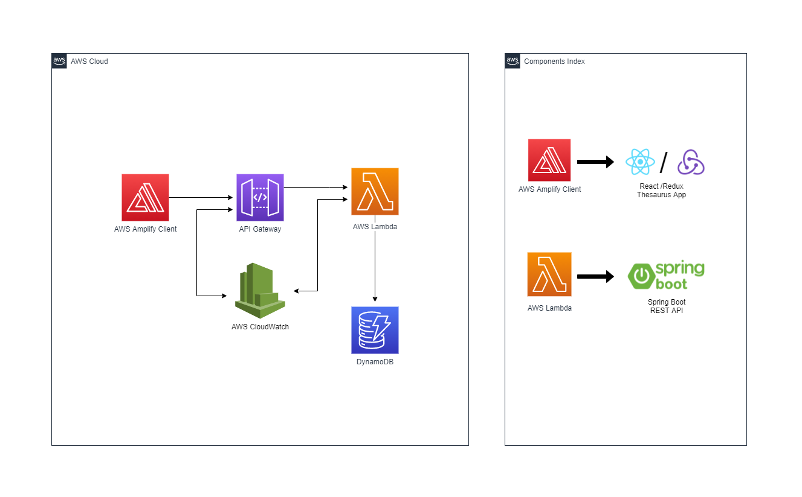

# fullstack-aws-lambda

Created Full-Stack Thesaurus Application to perform operations on entered words/phrases 

- Create Frontend using React JS & Redux toolkit, Deployed Frontend App to AWS Amplify 
- Created Backend using AWS Spring Boot lambda function. Clients send requests to an AWS API Gateway, which forwards the request to the lambda function.
- The Spring Boot Lambda function communicates with an AWS DynamoDB table and returns data back to the client (React app)

## App Preview 

 

## Deployment Strategy

